# Thesis
-----------

# Excercise 1:
-----------------------------------------

# Topic  Knowledge map (Topic Map/Ontology Map)

Topic: I am developing a tool to contextualize domain specific knowledge in Mechanical/Aeronautical engineering

Research question: to aid knowledge workers, mentors and teachers in managing and communicating information

Significance: in order to simplify the process of teaching complex subject matter

## Description

 A Relational tool for documenting and mapping archival documents, research references and web links

## Audience

 Discipline specific Knowledge workers/Professionals

 Need: A visual layout of domain knowledge

 Use as archival and mentoring tool

 Students

## Expectation

 Simple archival and bookmarking tool for documents/webpages

 Solve the problem of multiple browser tabs

 A local "help-me google search" tool; "mind-map my google search"

 Can be scaled and used as corporate knowledge management tool

 Automatically (autonomous or semi-autonomous) cluster and link topics
 
### Data, Information, Knowledge, Wisdom pyramid model

Roberts, J. (2015). A very short, fairly interesting and reasonably cheap book about knowledge management 55 City Road, London: SAGE Publications Ltd doi: 10.4135/9781473919709

### Limitations of catalogues; Dewey, Library of congress
Lump and split
Tagging

"The task of knowing is no longer to see the simple. It is to swim in the complex." p.198
In the world after the Enlightenment, the cultural task was to build knowledge. In the miscellaneous world, the task is to build meaning, even though we cnt yet know what well do with this new domain. p.222

Weinberger, David. Everything Is Miscellaneous: the Power of the New Digital Disorder. New York, NY: Holt, 2008

### Knowledge unit of measurement: nuggets p.59
Knowledge is more than just data, information. Clustering. p.112
Not evolutionary, but continuous accumulation. p.162
Episodic and semantic memory p.175
Measure transferability. p.211 Fi.2
Data mining is information processing, not knowledge management. p.259 which is what, how, why.
Sleep makes connections.

Geisler, Eliezer. Knowledge and Knowledge Systems Learning from the Wonders of the Mind. Hershey, PA: IGI Publications, 2008

## Pre-existing knowledge and expected response

 The problem of information overload (too much text data to contextualize)

 Knowledge management systems and archival tools keyword searches are limiting

 Argument against: 
Existing folder structures and browser tabs are adequate (but only for small amounts of documents). 
Library system cataloguing limitations.
Competing big-data tools

 The proposed tool will be different: Not an effort to "backup the internet", but rather to aid as a research tool that fills the void between automatic big-data systems and manual personal cataloguing research data and references

 Value is the "expert" filtering and contextualization of mass text data by human specialist (aided by machine)

## Data

 Test data and real data to be used

 Document metadata as primary source; text OCR and autotagging

 Course specific data such as all research papers from Data-viz MS in Data Viz course

 Engineering profession personal library

 References from librarians and knowledge management systems textbooks.

 Secondary sources: Papers and software on machine learning clustering, topic modelling, text auto-tagging. Techniques from these sources aims to improve user experience through novel application of basic modern machine learning and data processing.

## References

- Simon, Phil. The Visual Organization: Data Visualization, Big Data, and the Quest for Better Decisions. Hoboken, NJ: John Wiley and Sons, Inc., 2014.

- Roberts, Joanne. A Very Short, Fairly Interesting and Reasonably Cheap Book about Knowledge Management. Los Angeles, CA: Sage, 2015.

- Weinberger, David. Everything Is Miscellaneous: the Power of the New Digital Disorder. New York, NY: Holt, 2008.

- Geisler, Eliezer. Knowledge and Knowledge Systems Learning from the Wonders of the Mind. Hershey, PA: IGI Publications, 2008.

- Reference management:
https://www.zotero.org/

- Ontology mapping for semantically enabled applications
https://www.sciencedirect.com/science/article/pii/S1359644618304215

- InPhO Topic Explorer and Hypershelf
https://github.com/inpho/topic-explorer

- Exploring text datasets by visualizing relevant words
https://arxiv.org/abs/1707.05261

- A Visualization Tool in Support of Close Reading
http://www.sci.utah.edu/~nmccurdy/Poemage/

- Visualizing relevent words:
https://github.com/cod3licious/textcatvis

- Topicscape:
https://www.topicscape.com/#

- Intelligent tagging:
https://developers.refinitiv.com/open-permid/intelligent-tagging-restful-api

- DocumentAnalysis
http://vialab.science.uoit.ca/portfolio/docuburst

## Mindmap

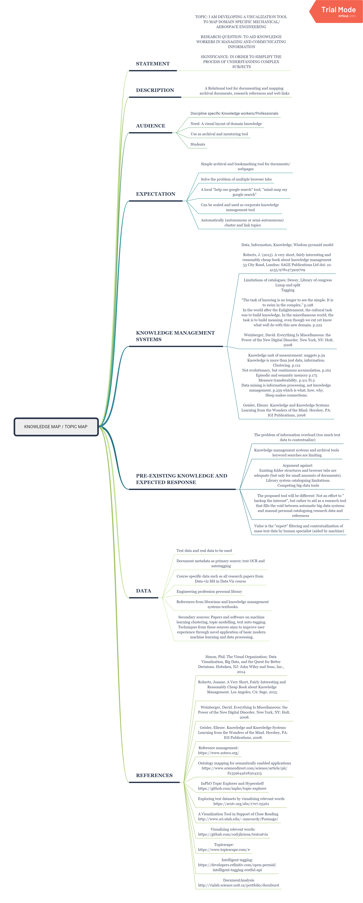

-----------------------------

# Exercise 2: FORM

The following section explores the initial background and form of the Thesis.

.jpg)
.jpg)
.jpg)
.jpg)
.jpg)
.jpg)
.jpg)
.jpg)
.jpg)

-----------------------------

# Exercise 3: PROTOTYPING

## Data Set

Online library of documents from the National Advisory Committee for Aeronautics (NACA):
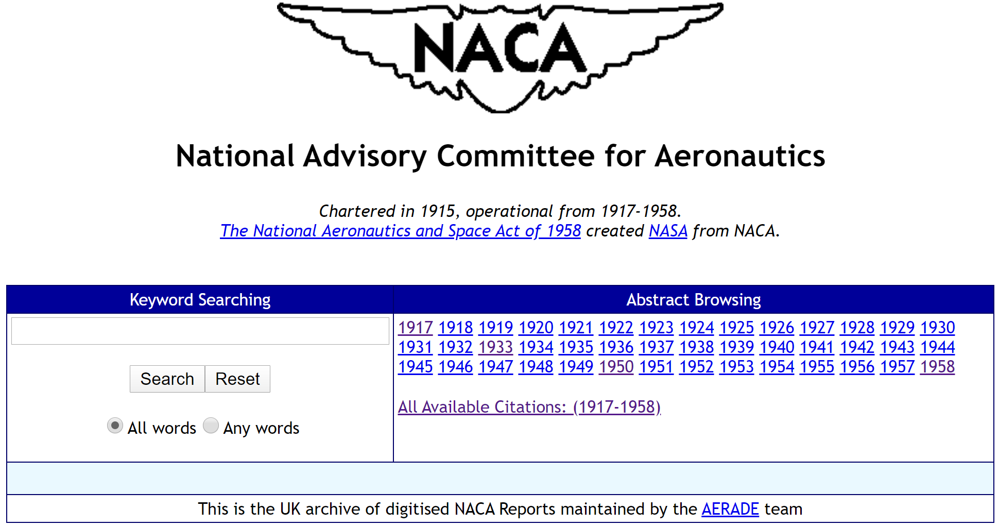
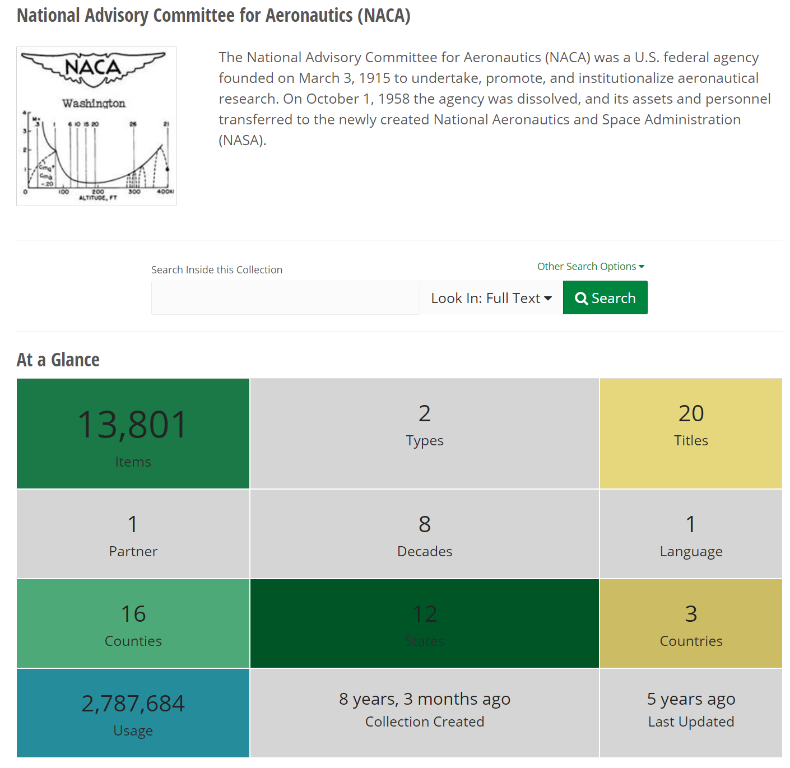
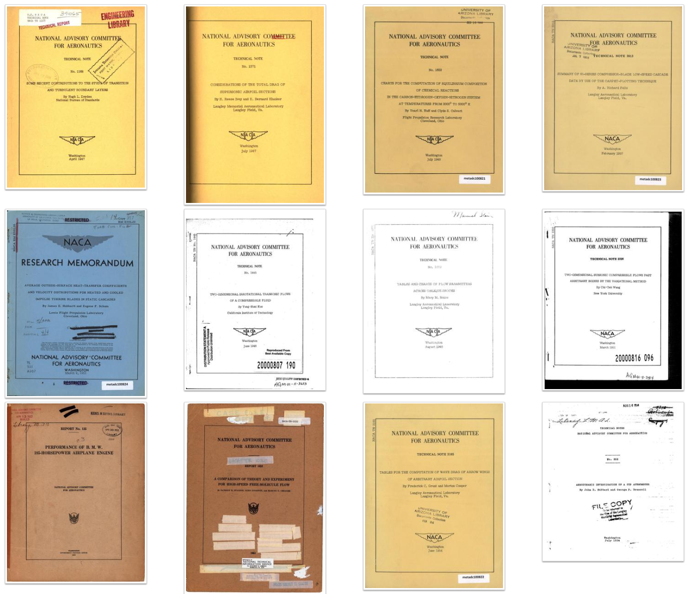
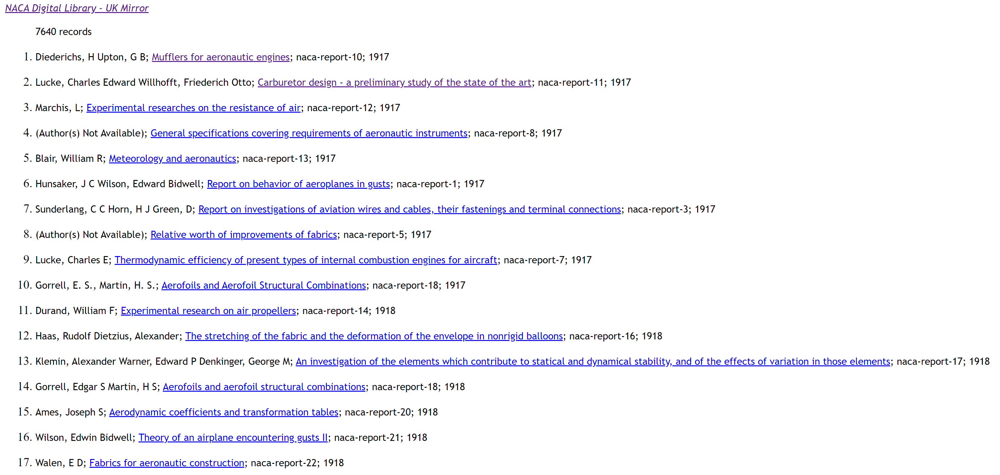
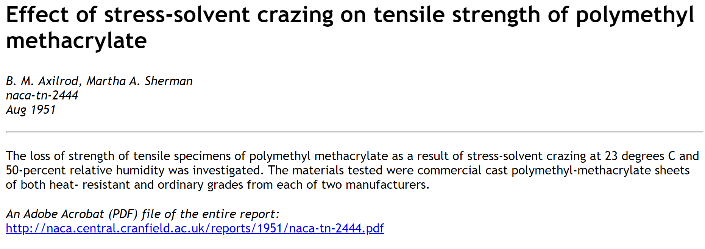

## Concept 1: Vertical Timeline Network Graph

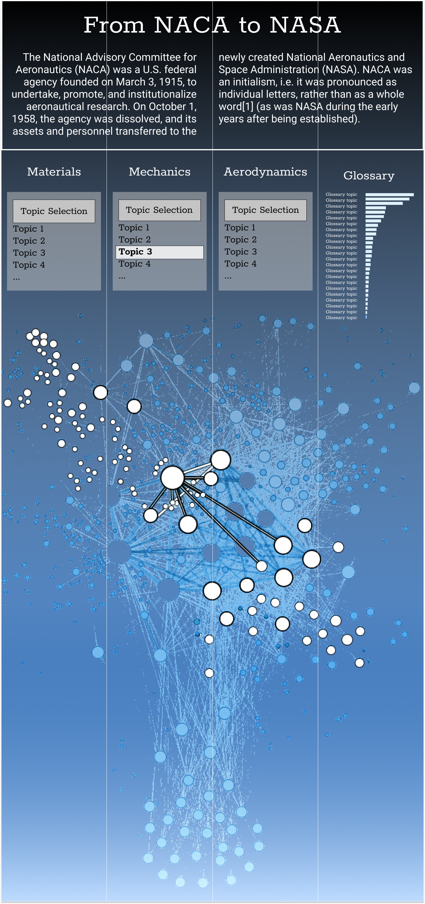

Small Multiples Effect of Nodes

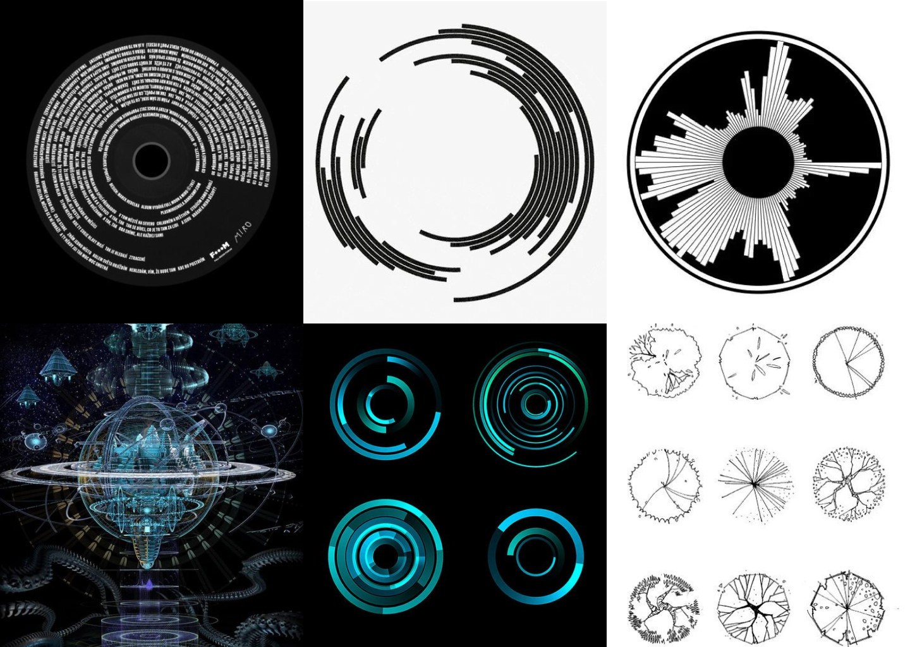

Node clustering logic: Voronoi Treemap

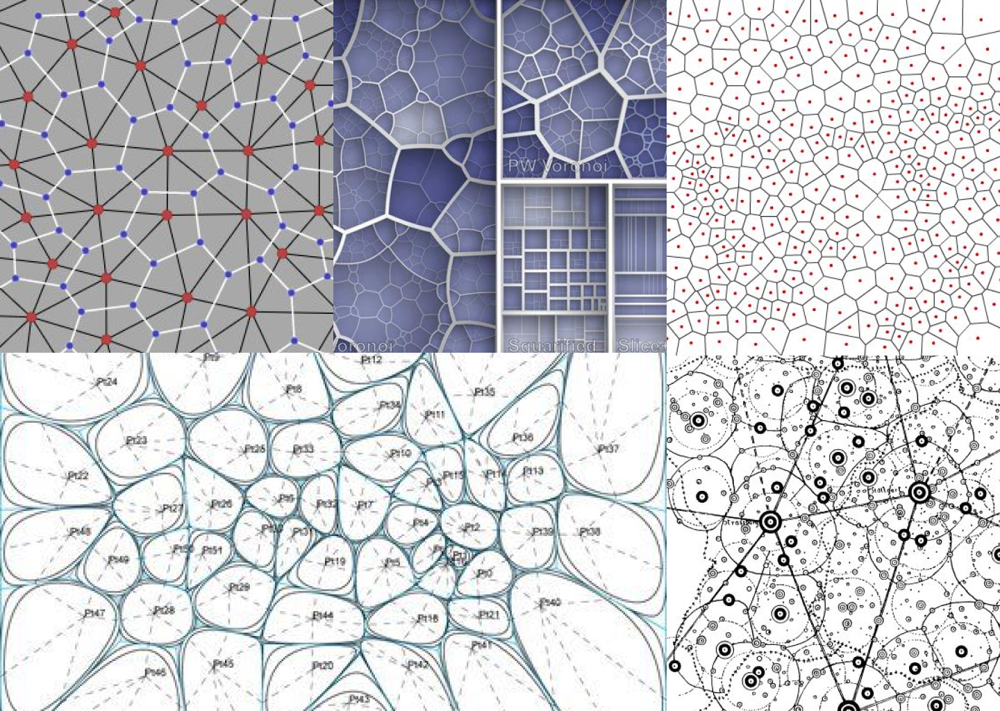

Inspiration from Star Charts

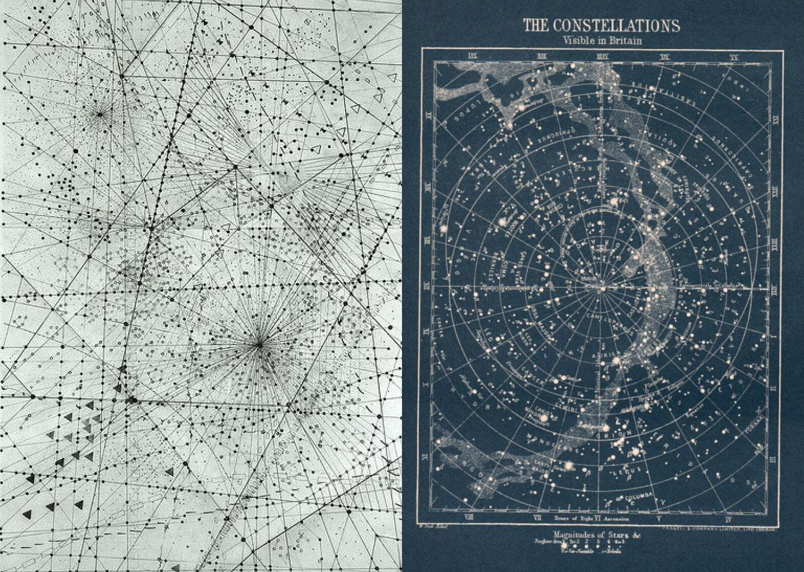

Topic Map Glyph Visual Language Inspiration

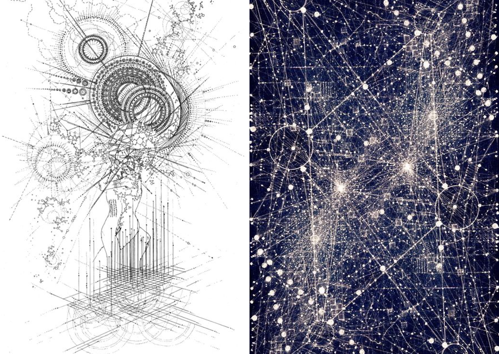

Highlighting a "Knowledge route"

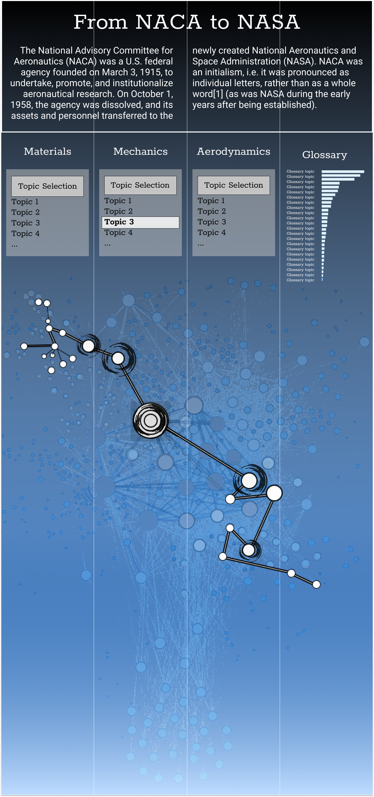

## Concept 2: Network Graph

Alternative implementation

Highlighting a "Knowledge route"

