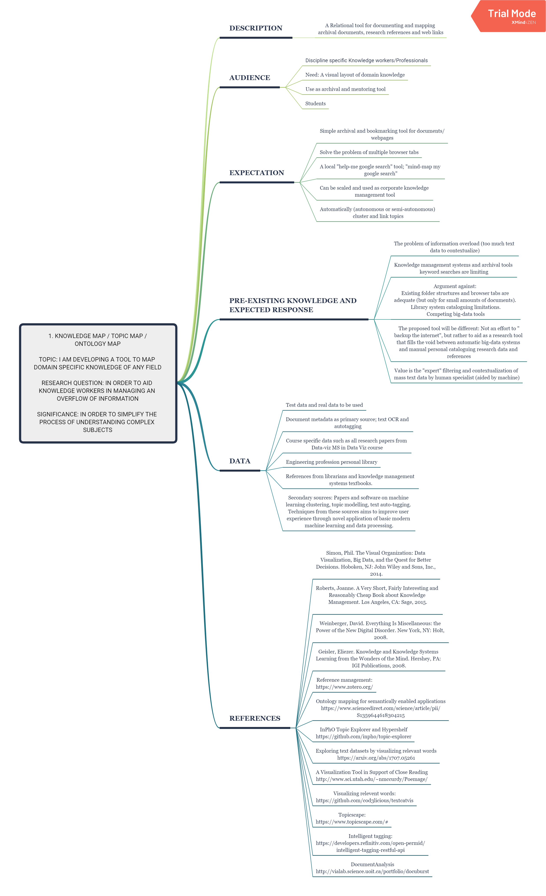
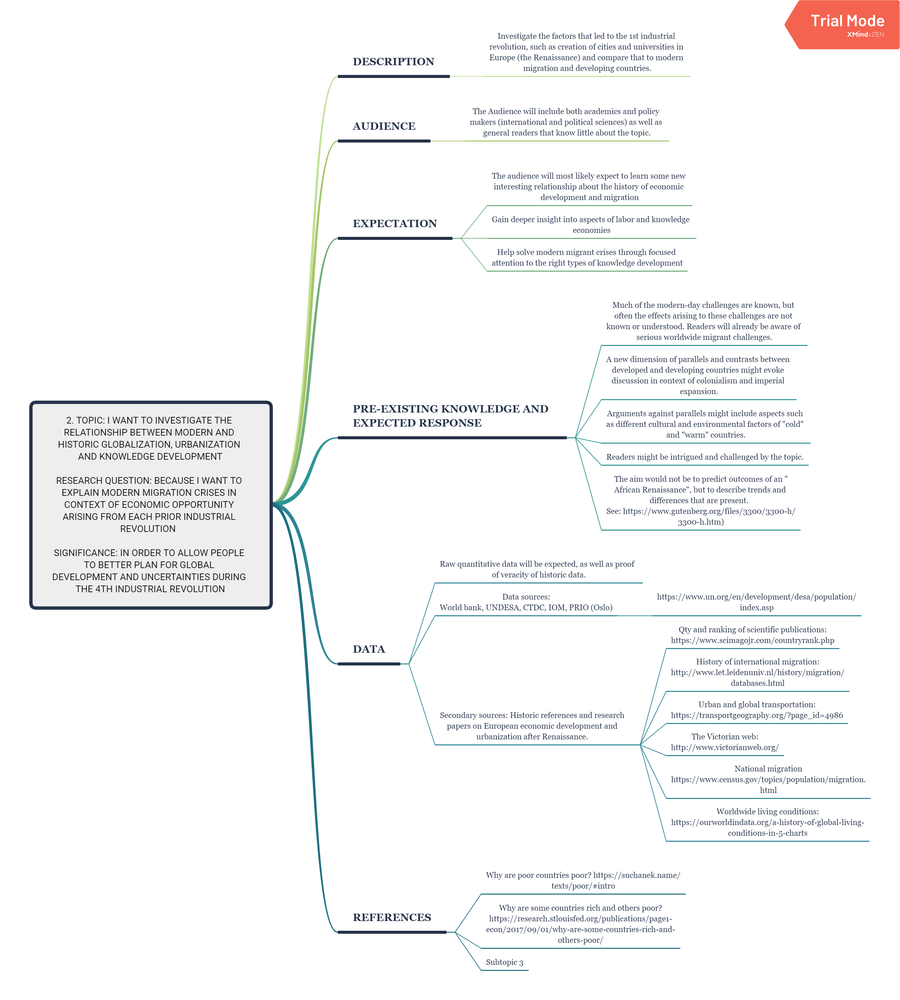
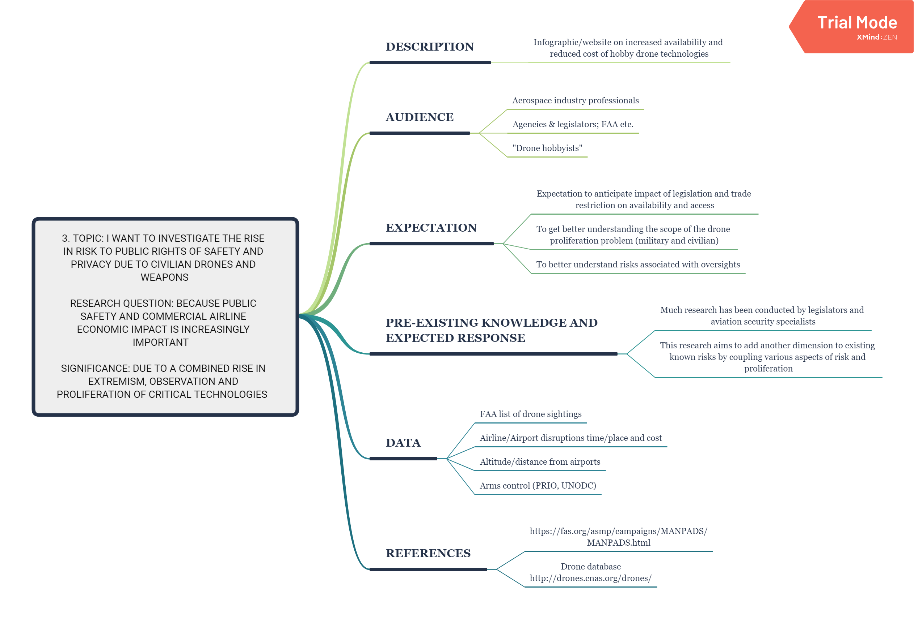

# Thesis
-----------

## Excercise 1: Research question(s)

-----------------------------------------

# Topic 1. Knowledge map (Topic Map/Ontology Map)

Topic: I am developing a tool to map domain specific knowledge of any field

Research question: in order to aid knowledge workers in managing an overflow of information

Significance: in order to simplify the process of understanding complex subjects

## Description

 A Relational tool for documenting and mapping archival documents, research references and web links

## Audience

 Discipline specific Knowledge workers/Professionals

 Need: A visual layout of domain knowledge

 Use as archival and mentoring tool

 Students

## Expectation

 Simple archival and bookmarking tool for documents/webpages

 Solve the problem of multiple browser tabs

 A local "help-me google search" tool; "mind-map my google search"

 Can be scaled and used as corporate knowledge management tool

 Automatically (autonomous or semi-autonomous) cluster and link topics

## Pre-existing knowledge and expected response

 The problem of information overload (too much text data to contextualize)

 Knowledge management systems and archival tools keyword searches are limiting

 Argument against: 
Existing folder structures and browser tabs are adequate (but only for small amounts of documents). 
Library system cataloguing limitations.
Competing big-data tools

 The proposed tool will be different: Not an effort to "backup the internet", but rather to aid as a research tool that fills the void between automatic big-data systems and manual personal cataloguing research data and references

 Value is the "expert" filtering and contextualization of mass text data by human specialist (aided by machine)

## Data

 Test data and real data to be used

 Document metadata as primary source; text OCR and autotagging

 Course specific data such as all research papers from Data-viz MS in Data Viz course

 Engineering profession personal library

 References from librarians and knowledge management systems textbooks.

 Secondary sources: Papers and software on machine learning clustering, topic modelling, text auto-tagging. Techniques from these sources aims to improve user experience through novel application of basic modern machine learning and data processing.

## References

- Simon, Phil. The Visual Organization: Data Visualization, Big Data, and the Quest for Better Decisions. Hoboken, NJ: John Wiley and Sons, Inc., 2014.

- Roberts, Joanne. A Very Short, Fairly Interesting and Reasonably Cheap Book about Knowledge Management. Los Angeles, CA: Sage, 2015.

- Weinberger, David. Everything Is Miscellaneous: the Power of the New Digital Disorder. New York, NY: Holt, 2008.

- Geisler, Eliezer. Knowledge and Knowledge Systems Learning from the Wonders of the Mind. Hershey, PA: IGI Publications, 2008.

- Reference management:
https://www.zotero.org/

- Ontology mapping for semantically enabled applications
https://www.sciencedirect.com/science/article/pii/S1359644618304215

- InPhO Topic Explorer and Hypershelf
https://github.com/inpho/topic-explorer

- Exploring text datasets by visualizing relevant words
https://arxiv.org/abs/1707.05261

- A Visualization Tool in Support of Close Reading
http://www.sci.utah.edu/~nmccurdy/Poemage/

- Visualizing relevent words:
https://github.com/cod3licious/textcatvis

- Topicscape:
https://www.topicscape.com/#

- Intelligent tagging:
https://developers.refinitiv.com/open-permid/intelligent-tagging-restful-api

- DocumentAnalysis
http://vialab.science.uoit.ca/portfolio/docuburst

## Mindmap

-----------------------------------------

# 2. The Urbanization, Globalization and the rise of Knowledge Economies

Topic: I want to investigate the relationship between modern and historic Globalization, Urbanization and knowledge development

Research question: because I want to explain modern migration crises in context of economic opportunity arising from each prior industrial revolution  

Significance: in order to allow people to better plan for global development and uncertainties during the 4th industrial revolution

## Description

 Investigate the factors that led to the 1st industrial revolution, such as creation of cities and universities in Europe (the Renaissance) and compare that to modern migration and developing countries.

## Audience

 The Audience will include both academics and policy makers (international and political sciences) as well as general readers that know little about the topic.

## Expectation

 The audience will most likely expect to learn some new interesting relationship about the history of economic development and migration

 Gain deeper insight into aspects of labor and knowledge economies

 Help solve modern migrant crises through focused attention to the right types of knowledge development

## Pre-existing knowledge and expected response

 Much of the modern-day challenges are known, but often the effects arising to these challenges are not known or understood. Readers will already be aware of serious worldwide migrant challenges.

 A new dimension of parallels and contrasts between developed and developing countries might evoke discussion in context of colonialism and imperial expansion.

 Arguments against parallels might include aspects such as different cultural and environmental factors of "cold" and "warm" countries.

 Readers might be intrigued and challenged by the topic.

 The aim would not be to predict outcomes of an "African Renaissance", but to describe trends and differences that are present.  
See: https://www.gutenberg.org/files/3300/3300-h/3300-h.htm)

## Data

 Raw quantitative data will be expected, as well as proof  of veracity of historic data.

 Data sources:
World bank, UNDESA, CTDC, IOM, PRIO (Oslo)

- https://www.un.org/en/development/desa/population/index.asp

 Secondary sources: Historic references and research papers on European economic development and urbanization after Renaissance. 

- Qty and ranking of scientific publications:
https://www.scimagojr.com/countryrank.php
- History of international migration:
http://www.let.leidenuniv.nl/history/migration/databases.html
- Urban and global transportation:
https://transportgeography.org/?page_id=4986
- The Victorian web:
http://www.victorianweb.org/
- National migration
https://www.census.gov/topics/population/migration.html
- Worldwide living conditions:
https://ourworldindata.org/a-history-of-global-living-conditions-in-5-charts

## References

- Why are poor countries poor? https://suchanek.name/texts/poor/#intro

- Why are some countries rich and others poor?
https://research.stlouisfed.org/publications/page1-econ/2017/09/01/why-are-some-countries-rich-and-others-poor/

## Mindmap

-----------------------------------------

# 3. Drones, privacy and security

Topic: I want to investigate the rise in risk to public rights of safety and privacy due to civilian drones and weapons

Research question: because public safety and commercial airline economic impact is increasingly important   

Significance: due to a combined rise in extremism, observation and proliferation of critical technologies  

## Description

 Infographic/website on increased availability and reduced cost of hobby drone technologies

## Audience

 Aerospace industry professionals

 Agencies & legislators; FAA etc.

 "Drone hobbyists"

## Expectation

 Expectation to anticipate impact of legislation and trade restriction on availability and access.

 To get better understanding the scope of the drone proliferation problem (military and civilian).

 To better understand risks associated with oversights.

## Pre-existing knowledge and expected response

 Much research has been conducted by legislators and aviation security specialists.

 This research aims to add another dimension to existing known risks by coupling various aspects of risk and proliferation

## Data

 - FAA list of drone sightings

 - Airline/Airport disruptions time/place and cost

 - Altitude/distance from airports

 - Arms control (PRIO, UNODC)

## References

- Proliferation of weapons: https://fas.org/asmp/campaigns/MANPADS/MANPADS.html

- Drone database: 
http://drones.cnas.org/drones/

## Mindmap

